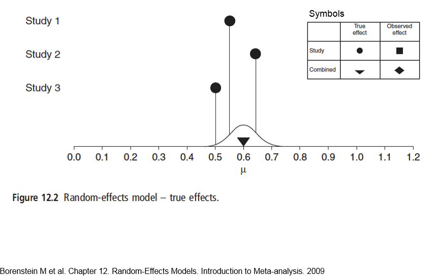
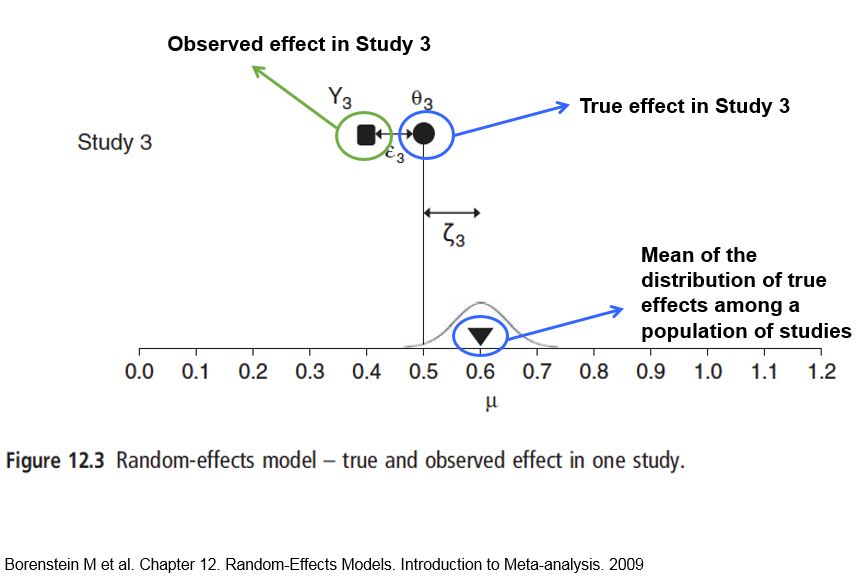

```{r setup, include=FALSE}
library(learnr)
library(metafor)
continuous_dat <- read.csv("www/Borenstein_p88.csv")
knitr::opts_chunk$set(echo = FALSE)
```


## Introduction
This website introduces you to two types of meta-analysis, **fixed-effects** and **random-effects** analysis, and also shows you how to calculate effect sizes manually, and hence the mechanics of a simple meta-analysis. In most of this module you will use automatic methods to calculate effect sizes and do the meta-analysis, but doing some of the basics manually will give you a better understanding. Finally, we address the problem that when you are collating information from several different studies they may not all report the information in the same way. For example one paper may have the means, standard errors and sample sizes, making it easy to calculate the standardised mean differences. However, another might report means, t-statistics and p-values. These cannot all be analysed automatically until they are converted to the same format.

To do this you need to understand more about the mechanics of calculating effect sizes, which (sorry!) results in a few equations to work through in this website.

### Vectorised arithmetic
Manual calculation of effect sizes is made easier by R's **vectorised arithmetic** which means that you can apply the same  calculation to every element in a table of data. For example, the following code block contains a `data.frame` called `study_dat` with two columns `x1` and `v1`. If you wish to calculate a third column that contains `x1` multiplied by `v1` this can be done simultaneously down every element of the of the column. You can also access e.g. the third row using `study_dat[3,]`, or the second column with `study_dat[,2]` or `study_dat$v1`. To access the fourth entry in the second column use `study_dat[4,2]` or `study_dat$v1[4]`. You might to access individual entries in a table of data when converting from one effect size type to another if reporting is inconsistent between studies.

Play around with the `study_dat` data in the following code box to familiarise yourself with how to access individual rows or columns or entries in a table of data. What do you think `NA` represents, and what happens when it occurs in calculations?

```{r vectorised-setup}
study_dat <- data.frame(x1 = c(4, 5, 7, 9, 0, 2), v1 = c( 3.2, 1.7, 9.8, NA, 4.0, 3.3))
```

```{r vectorised, exercise=TRUE}
# Display study_dat
study_dat
# Create a new column by multiplication
study_dat$x1v1 <- study_dat$x1 * study_dat$v1
study_dat
# Display 3rd row
study_dat[3,]
# Display fourth entry of x1
study_dat$x1[4]
```

## Fixed- vs Random-effects
### Reminder of simple meta-analysis and forest plot
First, a quick revision of some basic concepts. Meta-analysis is basically a weighted average of standardised effect sizes. We need to use standardised effect sizes as different studies may have used different measures, units etc. and so standardising by the pooled standard deviation makes them easier to compare. The weights are derived from the sample size and variation in each study. Forest plots provide a simple summary of a meta-analysis; here is the example from [the earlier website](https://naturalandenvironmentalscience.shinyapps.io/Effectsizes/#section-interactive-forest-plot-of-meta-analysis), taken from Borenstein:

{width=75%}

Here the squares represent the standardised effect size for the individual studies and the size of the squares their weights. The diamond represents the overall weighted average of the effect size, and the width of the diamond represents the degree of uncertaintity about the overall estimate.

### Fixed-effects meta-analysis
In a fixed effect analysis, all the studies are assumed to have the same ‘true’ effect, and all the factors that could influence the effect size are the same in all the studies. However, there is still sampling error, which is reflected in the different results for each study The study weights are assigned as the inverse of the variance of each study. This can be summed up in the following diagram:

{width=75%}

So the key point with a fixed-effect model is that the observed effect $Y_i$ for any given study $i$ is:

$$Y_i = \theta + \epsilon_i$$
where $\theta$ (Greek letter _theta_) is the overall "population" mean and $\epsilon_i$ (Greek letter _epsilon_) is the sampling error (which might be positive or negative). Have a look at [this  website](https://naturalandenvironmentalscience.shinyapps.io/Effectsizes/#section-populations-and-samples) to remind yourself of populations and samples.

### Random effects models
One problem with the fixed-effect method is that it assumes that all the studies are identical, and that the real effect size is the same in all the studies. Of course in reality this is unlikely to be true. The underlying effect sizes are likely to differ.  For example, survival of an endangered mammal population as a result of a management intervention may partly depend on the age of the mammals in the different populations in each of the different studies, as well as the actual management intervention. The diagram below shows the true effect sizes (0.55, 0.65 and 0.50) in three studies, assuming no observation error whatsoever, $\delta_1$, $\delta_2$ and $\delta_3$. The curve represents the normal distribution around all true effects.

{width=75%}

Of course in reality, there is observation error, so for our third study there is both the sampling error, shown as $\epsilon_3$ below which is the difference of what was observed, $Y_3$ and the true effect size $\delta_3$ in that study. The study effect size differs from the overall effect size for all studies by $\zeta_3$ as shown below:

{width=75%}

So, we can say that the observed effect $Y_i$ for any study is given by the grand mean $\mu$ (Greek letter _mu_), the deviation of the study's true effect from the grand mean $\zeta_i$ (Greek letter _zeta_), and the sampling error in that study $\epsilon_i$ (Greek letter _epsilon_):

$$Y_i = \mu + \zeta_i + \epsilon_i$$
This equation covers both within-study variation $\epsilon_i$ and between-study variation $\zeta_i$.

## Manual calculation of effect size for continuous data
For this example we will use a set of data in Borenstein page 88, in which there are six studies, for which we know the **means, standard deviations and sample sizes** of two interventions, treatment `T` and the control `C`. These are two commonly used effect sizes for continuous data:

* Standardised mean difference _d_
* Hedge's _g_ (bias corrected)

The relevant data are contained in the R `data.frame` called `continuous_dat`:

```{r, echo=FALSE}
print(continuous_dat)
```


### Standardised mean difference _d_
First we want to calculate the standardised mean difference _d_ for
treatment and control in each study, which is done via:

$$d=\frac{\overline{X_1}-\overline{X_2}}{S_{within}}$$

where $\overline{X_1}$ and $\overline{X_2}$ are the means of the Treatment and Control of the study, and ${S_{within}}$ is the within-groups standard deviation. The latter can be calculated from:

$$S_{within}=\sqrt{\frac{(n_1-1)S^2_1 + (n2-1)S^2_2}  {n_1 + n_2 - 2}}$$

where $n_1$ and $n_2$ are the numbers of replicates for the two treatments in the study, whilst $S^2_1$ and $S^2_1$ are the respective standard deviations. We can easily calculate these two values for the first study, by Carroll, in R:

```{r manual_calc_Carroll, exercise=TRUE}
S_within_Carroll <- sqrt(((60-1)*22^2 +(60-1)*20^2) / (60 + 60 -2))
d_Carroll        <- (94 - 92) / S_within_Carroll
S_within_Carroll
d_Carroll


```

It would take a long time too long to do each calculation for every study, so this is where the vectorised arithmetic is useful, so you can find the results for all the studies simultaneously:

```{r manual_calc_S_within_d, exercise=TRUE}
S_within <- sqrt(((continuous_dat$T_n-1)*continuous_dat$T_SD^2 + (continuous_dat$C_n-1)*continuous_dat$C_SD^2) / 
                   (continuous_dat$T_n + continuous_dat$C_n -2))
d       <- (continuous_dat$T_mean - continuous_dat$C_mean) / S_within
cbind(S_within, d)

```

In above table `S_within` is the within-groups standard deviation, and _d_ is the standardised mean difference. We now want to calculate the variance of this standardised mean difference, $V_d$ :

$$V_d = \frac{n_1 + n_2}{n_1n_2}+\frac{d^2}{2(n_1+n_2)}$$

In the above equation, the first term on the right, $\frac{n_1 + n_2}{n_1n_2}$, represents the uncertainty in the difference betweens the means, $\overline{X_1}-\overline{X_2}$ . The second term on the right, $\frac{d^2}{2(n_1+n_2)}$, reflects the uncertainty of our estimate in the within-groups standard deviation $S_{within}$, calculated earlier.

We can calculate $V_d$ for the Carroll study first:

```{r Vd_Carroll-setup}
S_within_Carroll <- sqrt(((60-1)*22^2 +(60-1)*20^2) / (60 + 60 -2))
d_Carroll        <- (94 - 92) / S_within_Carroll

```

```{r Vd_Carroll, exercise=TRUE}
Vd_Carroll <- (60+60)/(60*60) + d_Carroll^2/(2*(60+60))
Vd_Carroll

```
Again, you have to be careful with brackets to ensure that the additions and multiplications etc. are down in the correct order.

`d_Carroll` represents _d_ or the standardised mean difference, also known as _Cohen's d_ .  Unfortunately _d_ has a slight bias in small sample sizes, and so needs to be fixed with a correction factor _J_ to calculate _g_ or _Hedge's g_, which is a more robust measure of the standardised mean difference. Most meta-analyses use _Hedge's g_ automatically, and the correction is easy to calculate:

$$J = 1 - \frac{3}{4df -1}$$
where $df$ is the degrees of freedom used to estimate $S_{within}$, which for two independent groups is simply $n_1+n_2-2$ (see equation fo $S_{within})$).

### Hedge's _g_ effect size
_Hedge's g_ is often a preferred effect size data, as it contains a "bias correction" term _J_:

$$g = J . d$$
Whilst the bias-correct variance $V_g$ is:
$$V_g = J^2 . V_d$$

We can now readily do these calculations in R for the Carroll study:

```{r J_Hedges_g_Carroll-setup}
S_within_Carroll <- sqrt(((60-1)*22^2 +(60-1)*20^2) / (60 + 60 -2))
d_Carroll        <- (94 - 92) / S_within_Carroll
Vd_Carroll <- (60+60)/(60*60) + d_Carroll^2/(2*(60+60))

```

```{r J_Hedges_g_Carroll, exercise=TRUE}
 # There were 60 replicates in each T and C
J_Carroll <- 1 - (3/(4 * 118 - 1))
g_Carroll <- J_Carroll * d_Carroll
Vg_Carroll <- J_Carroll^2 * Vd_Carroll
J_Carroll
g_Carroll
Vg_Carroll
```

Obviously, it would take a long time to calculate each of these values for all the studies separately, but again we can take advantage of R's vectorised system to calculate _J_ and _Hedge's g_ for all the studies in one go:

```{r J_Hedges_g_Vg_all-setup}
S_within <- sqrt(((continuous_dat$T_n-1)*continuous_dat$T_SD^2 +
                   (continuous_dat$C_n-1)*continuous_dat$C_SD^2) / 
                   (continuous_dat$T_n + continuous_dat$C_n -2))
d       <- (continuous_dat$T_mean - continuous_dat$C_mean) / S_within

```


```{r J_Hedges_g_Vg_all, exercise=TRUE}
J <- 1 - (3 / (4 * (continuous_dat$T_n + continuous_dat$C_n - 2) -1))
g <- J * d
Vd <- (continuous_dat$T_n+continuous_dat$C_n)/(continuous_dat$T_n*continuous_dat$C_n) +
   d^2/(2*(continuous_dat$T_n+continuous_dat$C_n))
Vg <- J^2 * Vd
cbind(J, d, g, Vd, Vg)

```

You can see from the above that the bias-correction values, _J_ are all near 1.0, but it is lower for the 3rd study, which has the smallest number of samples.  Values of J near to 1.0 indicate that less bias-correction is needed.

## Manual calculation of meta-analysis
### Overall weights W
Remember that in a meta-analysis you are basically calculating a weighted mean of the effect sizes, here the standardised mean differences as represented by Hedge's _g_, for the individual studies from your systematic review. 

Now that we have calculated the bias-corrected variance $V_g$ we can readily calculate the weight _W_ for an individual study:

$$W = \frac{1}{V_{g}}$$

Again, this is very simple to calculate for all the studies simultaneously using R's vectorised arithmetic:

```{r weights_all_studies-setup}
J <- 1 - (3 / (4 * (continuous_dat$T_n + continuous_dat$C_n - 2) -1))
g <- J * d
Vd <- (continuous_dat$T_n+continuous_dat$C_n)/(continuous_dat$T_n*continuous_dat$C_n) +
   d^2/(2*(continuous_dat$T_n+continuous_dat$C_n))
Vg <- J^2 * Vd

```

```{r weights_all_studies, exercise=TRUE}
W <- 1 / Vg
cbind(continuous_dat$T_n, Vd, W)

```

Notice how the weights are related to the sample size and the variance, so for example study 4, which has 200 replicates per treatment, has a weight much higher than the others. The lowest weight is, however, given to study 4, within only 40 replicates, and the highest variance.

To finish, we calculate the weighted mean, _M_, based on the sum of weights multipled by the standardised effect sizes, divided by the sum of the weights:

$$M = \frac{\sum_{i=1}^{k}W_ig_i}{\sum_{i=1}^{k}W_i}$$
where:

* $W_i$ are the weights for study number $1$ to study number $k$
* $g_i$ are the Hedge's _g_ for each study
* $\sum$ Greek letter (sigma) for sum

This equation may look threatening at first, but it simply indicates that for each study (i = 1 to k, where k is 6 for this example) we carry out multiplications and additions.  The $\sum_{}$ sign indicates summation.  Again, the whole set of calculations can easily be done in R via vectorised arithmetic:

```{r calc_M-setup}
S_within <- sqrt(((continuous_dat$T_n-1)*continuous_dat$T_SD^2 +
                   (continuous_dat$C_n-1)*continuous_dat$C_SD^2) / 
                   (continuous_dat$T_n + continuous_dat$C_n -2))
d       <- (continuous_dat$T_mean - continuous_dat$C_mean) / S_within

J <- 1 - (3 / (4 * (continuous_dat$T_n + continuous_dat$C_n - 2) -1))
g <- J * d
Vd <- (continuous_dat$T_n+continuous_dat$C_n)/(continuous_dat$T_n*continuous_dat$C_n) +
   d^2/(2*(continuous_dat$T_n+continuous_dat$C_n))
Vg <- J^2 * Vd
W <- 1 / Vg
```

```{r calc_M, exercise=TRUE}
M <- sum(W * g) / sum(W)
M

```

This gives an **overall standardised mean difference**, weighted for the different studies.
