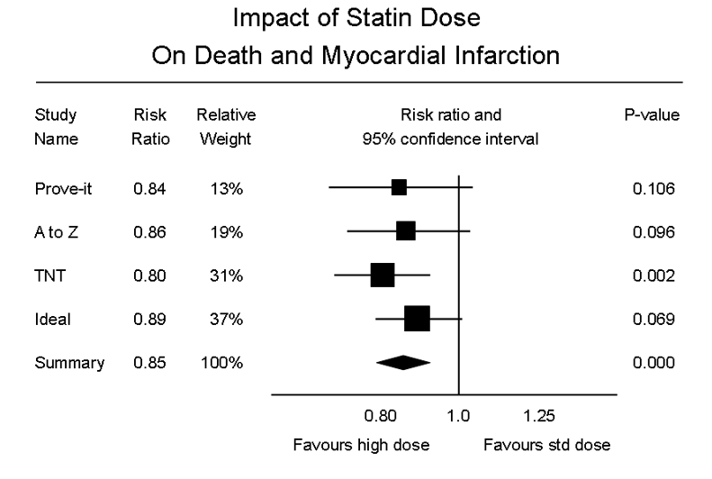
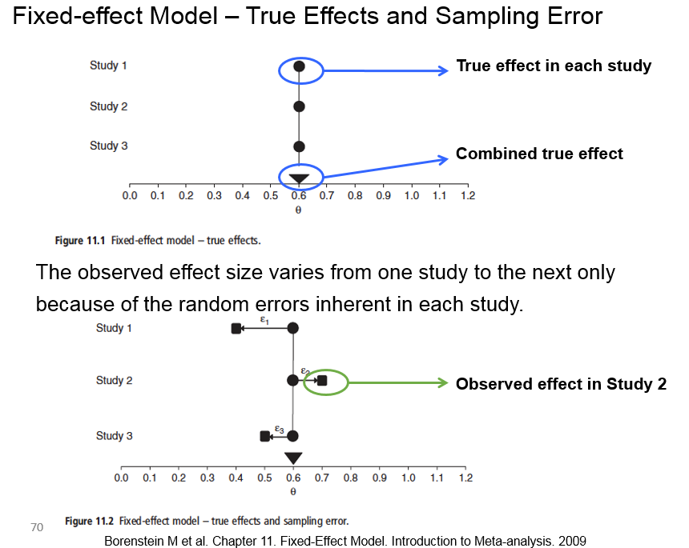
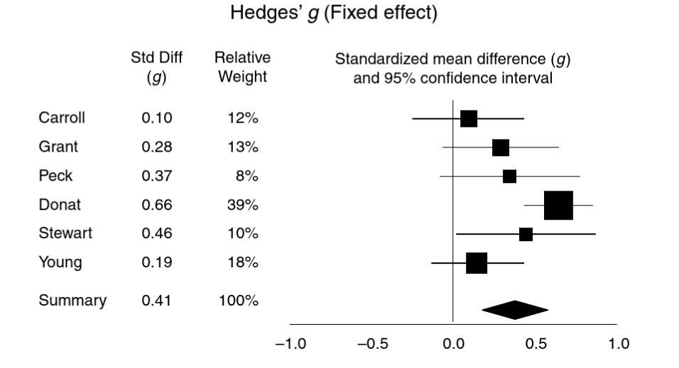

```{r setup, include=FALSE}
knitr::opts_chunk$set(echo = TRUE)
```

# Introduction
In this practical you are going to undertake some basic meta-analyses, using data from _Borenstein et al. (2009) Introduction to meta-analysis._ Many of the examples from this book are medical, rather than ecological, but it gives an exceptionally clear explanation of the underlying theory behind meta-analysis, included fixed- and random-effects.

We will do a 'manual' calculation of effect sizes and subsequently a meta-analysis, using R as a "hand-calculator". In the rest of this module you will use the `metafor` package, which has built-in functions for automatic calculation of effect sizes and subsequent meta-analysis. Although cumbersome, one advantage of doing it by hand initially is that it gives you a more thorough understanding of how meta-analysis works.

We will focus on a continuous set of data, with means and sds for treatment and control. These are the types of data you might obtain from studies comparing different environmental management or treatment regimes, sometimes as part of a planned experiment, but more usually a 'natural experiment' depending on the ecology of the set.

The main aims of this practical are to familiarise you with the 'mechanics' of effect sizes and meta-analysis, and explore filling in gaps for incompletely reported data. The sections are:

1. Revision of basics of meta-analysis
2. Example dataset of means for two treatments
3. Manual calculation of effect sizes (_d_ and then Hedges' _g_) and meta-analysis
4. How to derive suitable data for a meta-analysis from incomplete reporting of data

# 1. A quick reminder of meta-analysis
First, a quick revision of some basic concepts. Meta-analysis is basically a **weighted average of standardised effect sizes**.  We need to use standardised effect sizes as different studies may have used different measures, units etc. and so standardising by the pooled standard deviation makes them easier to compare. The weights are derived from the sample size and variation in each study. Forest
plots provide a simple summary of a meta-analysis:



Here the squares represent the standardised effect size for the individual studies and the size of the squares their weights.  The diamond represents the overall weighted average of the effect size, and the width of the diamond represents the degree of uncertaintity about the overall estimate.

# 2. Example dataset of continuous data
This is a dataset of 6 studies, stored in an Excel file (CSV format). The raw data are taken from page 88 of Borenstein.  First download the **Borenstein_p88.csv** data from Canvas, read in and display the data. You may need to modify the `read.csv()` call depending on where you have saved the data. I normally recommend that you use R Projects, and store all your data within a subfolder called `Data`

```{r}
# Continuous data
continuous_dat <- read.csv("Data/Borenstein_p88.csv")
continuous_dat  # Just entering the name is the same as print(continuous_dat)
```

You can see that the format of the data is fairly simple, with the means, SD and number of samples shown for thre Treatment (T) and Control (C) of each study. The sudy by Peck has relatively few samples (40 in T and C) and so will be given a lower weight in the meta-analysis, whilst that of Donat has 200 per treatment, and so will receive a high weight.

# 3. Fixed-effects meta-analysis with example data
In a fixed effect analysis, all the studies are assumed to have the same 'true' effect, and all the factors that could influence the effect size are the same in all the studies. However, there is still sampling error, which is reflected in the different results for each study  The study weights are assigned as the inverse of the variance of each study.  This can be summed up in the following diagram:



So the key point with a fixed-effect model is that the observed effect $Y_i$ for any given study $i$ is:

$$Y_i = \theta + \epsilon_i$$
where $\theta$ (Greek letter _theta_) is the overall "population" mean and $\epsilon_i$ (Greek letter _epsilon_) is the sampling error (which might be positive or negative)

## 3.1 Standardised mean difference _d_ for single study
The standardised mean difference is often reported in studies. Somewhat confusingly, you may see it referred to as "Cohen's _d_" or even "Hedges' _d_" in some books, so you might want to double-check their equations to work out exactly what they are referring to, as there is a frustrating lack of consistency in the meta-analysis literature. First we want to calculate the standardised mean difference _d_ for
treatment and control in each study, which is done via:

$$d=\frac{\overline{X_1}-\overline{X_2}}{S_{within}}$$

where $\overline{X_1}$ and $\overline{X_2}$ are the means of the Treatment and Control of the study, and ${S_{within}}$ is the within-groups standard deviation. The latter can be calculated from:

$$S_{within}=\sqrt{\frac{(n_1-1)S^2_1 + (n2-1)S^2_2}  {n_1 + n_2 - 2}}$$

where $n_1$ and $n_2$ are the numbers of replicates for the two treatments in the study, whilst $S^2_1$ and $S^2_1$ are the respective standard deviations. We can easily calculate these two values for the first study, by Carroll, in R:

```{r manual calculation of Carroll}
S_within_Carroll <- sqrt(((60-1)*22^2 +(60-1)*20^2) / (60 + 60 -2))
d_Carroll        <- (94 - 92) / S_within_Carroll

S_within_Carroll
d_Carroll

```

This is a little bit cumbersome, as you have to make sure you enter all the correct brackets, to ensure the multiplications, subtractions and divisions are done in the right order.  Check that your figures for Carroll match the ones in the schedule.

## 3.2 Vectorised calculation of _d_ and $S_{within}$ for multiple studies
Of course, it would take a long time to do each calculation for every study, but luckily R allows 'vectorised' arithmetic, so you can find the results for all the studies simultaneously. **Note** in the code below the indented code is actually all part of the $\sqrt{}$ symbol from the equation for $S_{within}$ above.

```{r manual calculation S_within d}
S_within <- sqrt(((continuous_dat$T_n-1)*continuous_dat$T_SD^2 +
                   (continuous_dat$C_n-1)*continuous_dat$C_SD^2) / 
                   (continuous_dat$T_n + continuous_dat$C_n -2))
d       <- (continuous_dat$T_mean - continuous_dat$C_mean) / S_within


cbind(S_within, d)

```

In above table `S_within` is the within-groups standard deviation, and _d_ is the standardised mean difference.

## 3.3 Calculation of variance for a single study
We now want to calculate the variance of this standardised mean difference, $V_d$ :

$$V_d = \frac{n_1 + n_2}{n_1n_2}+\frac{d^2}{2(n_1+n_2)}$$

In the above equation, the first term on the right, $\frac{n_1 + n_2}{n_1n_2}$, represents the uncertainty in the difference betweens the means, $\overline{X_1}-\overline{X_2}$ . The second term on the right, $\frac{d^2}{2(n_1+n_2)}$, reflects the uncertainty of our estimate in the within-groups standard deviation $S_{within}$, calculated earlier.

We can calculate $V_d$ for the Carroll study first:

```{r Vd for Carroll study}
Vd_Carroll <- (60+60)/(60*60) + d_Carroll^2/(2*(60+60))

Vd_Carroll
```

Again, you have to be careful with brackets to ensure that the additions and multiplications etc. are down in the correct order.

`d_Carroll` represents _d_ or the standardised mean difference, also known as _Cohen's d_ (you may confusingly see this called Hedges' _d_ in some books).

## 3.4 Hedges' _g_ and variance for single study
Unfortunately _d_ has a slight bias in small sample sizes, and so needs to be fixed with a correction factor _J_ to calculate _g_ or _Hedge's g_, which is a more robust measure of the standardised mean difference. Most meta-analyses use _Hedge's g_ automatically, and the correction is easy to calculate:

$$J = 1 - \frac{3}{4df -1}$$
where $df$ is the degrees of freedom used to estimate $S_{within}$, which for two independent groups is simply $n_1+n_2-2$ (see equation fo $S_{within})$). _Hedge's g_ is then easily calculated as:

$$g = J . d$$
Whilst the bias-correct variance $V_g$ is:
$$V_g = J^2 . V_d$$

We can now readily do these calculations in R for the Carroll study:

```{r J and Hedges g for Carroll}
J_Carroll <- 1 - (3/(4 * 118 - 1)) # There were 60 replicates in each T and C
g_Carroll <- J_Carroll * d_Carroll
Vg_Carroll <- J_Carroll^2 * Vd_Carroll

J_Carroll
g_Carroll
Vg_Carroll
```


## 3.5 Vectorised calculation of Hedges' _g_ and variance for multiple studies
Obviously, it would take a long time to calculate each of these values for all the studies separately, but again we can take advantage of R's vectorised system to calculate _J_ and _Hedge's g_ for all the studies in one go:

```{r J Hedges g, Hedges Vg all studies}
J <- 1 - (3 / (4 * (continuous_dat$T_n + continuous_dat$C_n - 2) -1))
g <- J * d
Vd <- (continuous_dat$T_n+continuous_dat$C_n)/(continuous_dat$T_n*continuous_dat$C_n) +
   d^2/(2*(continuous_dat$T_n+continuous_dat$C_n))
Vg <- J^2 * Vd

cbind(J, d, g, Vd, Vg)
```
You can see from the above that the bias-correction values, _J_ are all near 1.0, but it is lower for the 3rd study, at `r J[3]` which has the smallest number of samples.  Values of J near to 1.0 indicate that less bias-correction is needed.

## 3.5. Calculate weights for each study and overall weighted mean effect size
Now we can assemble everything together for the actual meta-analysis. Remember that a meta-analysis is simply a weighted average of the standardised mean differences. Now that we have calculated the bias-corrected variance $V_g$ we can readily calculate the weight _W_ for an individual study:

$$W = \frac{1}{V_{g}}$$
Again, this is very simple to calculate for all the studies using R's vectorised arithmetic:

```{r weights for all studies}
W <- 1 / Vg
cbind(continuous_dat$T_n, Vd, W)
```

Notice how the weights are related to the sample size and the variance, so for example study 4, which has 200 replicates per treatment, has a weight much higher than the others. The lowest weight is, however, given to study 4, within only 40 replicates, and the highest variance.

To finish, we calculate the weighted mean, _M_, based on the sum of weights multipled by the standardised effect sizes, divided by the sum of the weights:

$$M = \frac{\sum_{i=1}^{k}W_ig_i}{\sum_{i=1}^{k}W_i}$$
This equation may look threatening at first, but it simply indicates that for each study (i = 1 to k, where k is 6 for this example) we carry out multiplications and additions.  The $\sum_{}$ sign indicates summation.  Again, the whole set of calculations can easily be done in R via vectorised arithmetic:

```{r calculation of M}
M <- sum(W * g) / sum(W)
M
```

This gives an overall standardised mean difference, weighted for the different studies, of `r M`.

Here is the forest plot that can be derived from these studies:



Compare your weights `W` and Hedges' _g_ values `g` that you manually calculated with those shown here (Fig. 14.1 of Borenstein). In the next practical you will learn how to create these forest plots automatically.

# 4. Working with incomplete data
Most books on meta-analysis will give you worked examples where all the data you need for the analysis are available in a convenient format. This might be in the book, or online supplement, and you will find the means or binary counts or correlations as well as the standard deviations and sample sizes for a set of studies. This makes it much more straightforward to complete the meta-analysis at hand, once you have decided on the appropriate metric to use in your effect size.

The problem is that in a "real" systematic review, the papers you collate together will be inconsistent. Some authors might give p-values and t-statistics, but be vague on sample size, or some aspect of the effects that you are trying to analyse. This website shows you how to manually fill in some of the "gaps" in the data, for an example of messy continuous and an example of gappy binary (count) data. There is not an automatic function that will do this for you, so it is a useful skill to have, to increase the number of studies that you can incorporate into your meta-analysis.

Of course, sometimes no amount of clever back-transformations can help you, and you also need to be able to recognise situations where it is not possible to include the study in your meta-analysis. In this website we will focus on an incomplete dataset where means and standard deviations are only available for some studies.

**Note** some equations in this section are not identical to those earlier in the schedule as approximations have to be used where data are incomplete.

First, download the `cont_incomplete.csv` dataset from Canvas, save into your `Data` folder, import into RStudio via `read.csv()` into a `data.frame` called `cont_incomp_dat` and explore the data. You will see that there are 9 studies, but unfortunately only 3 of them have the complete set of data needed for analysis. Key points to note are:

* `n1i` and `n2i` are sample sizes; all the studies report sample sizes; **this is important**
* `m1i` and `m2i` are the means for the two treatments, but these are not given for every study
* `sd1i` and `sd2i` are the standard deviations, but again not reported for every study
* Studies 3, 4 and 6 provide all the necessary information
* Studies 2 and 9 report the 2-sided p-value `pval` from a t-test and we know the direction of the effect positive or negative in `sign` **but** we don't know the t-statistic
* Studies 5 and 8 report t-statistic `tval` from a t-test
* Studies 1 and 7 report standardised mean difference `dval`, sometimes called Cohen's _d_, rather than what we are more likely to use, Hedges' _g_ which has a bias-correction for small sample sizes

Whilst we are not going to use `metafor` yet for a formal meta-analysis, we will take advantage of some utility functions it has that make it simpler to handle missing data. R conventionally uses the `is.na()` function when working with missing data, but this can be cumbersome to use, especially on columns of data. In contrast, the `metafor` package as a `replmiss()` function, which replaces missing values according to an equation we provide. Therefore, before you go any further issue the command `library(metafor)` in the R Console.

If you have not yet installed the package, you will need to run the command `install.packages("metafor")` first, but this is only needed once.

```{r, echo=FALSE, message=FALSE}
library(metafor)
cont_incomp_dat <- read.csv("assemble_data/www/cont_incomplete.csv")
```

To try and "fix" our incomplete data we are going to carry out the following steps

1. Calculate Hedges' _g_ for the studies with no problems
2. Find t-statistics for studies that only give p-values
3. Calculate _d_ effect size (**not** bias-corrected) from t-statistics
4. Calculate Hedges' _g_ from _d_
5. Calculate sample variance _V_

## 4.1 Hedges _g_ for studies with no problems; 3, 4, 6 
These are studies 3, 4 and 6. These are the only ones where we can easily calculate the standardised mean difference bias-corrected, i.e. the Hedges' _g_ measure of the effect size.

If you have not already done so, remember to import your data from the `cont_incomplete.csv` file on Canvas into a dataframe called `cont_incomp_dat` and look at its contents before going further.

This is your first use of one of the built-in functions of `metafor`, namely the `escalc()` or "effect-size calculator" function. This is very powerful, and can handle continuous mean data as in this example, count data, correlation data, and produce many different metrics of effect size. The `"SMD"` option for measure, shown below, is Hedges _g_. 

```{r hedges_g}
# Original data
cont_incomp_dat

# Calculate Hedges' g
cont_incomp_dat <- escalc(measure="SMD", m1i=m1i, sd1i=sd1i, n1i=n1i, m2i=m2i, sd2i=sd2i, n2i=n2i, data=cont_incomp_dat)

# Revised dataset just for studies 3, 4, 6
cont_incomp_dat
```

The code **overwrites** your original incomplete dataset, filling in the calculations. Notice how it only changes things for the three studies 3, 4 and 6 where all the necessary data are available, and in the process creates two new columns:

* `yi`  The effect size, here Hedges' _g_
* `vi`  The estimated variance

You may wish to go back to Section 3 of this schedule at some point and use `escalc()` rather than manual calculations. Obviously, it would have saved you a lot of time, but I wanted you to explore manual calculation first.

## 4.2 Calculate t-statistics from p-values; studies 2 and 9
Here we have a p-value, and (fortunately) we know the sample size. However, the reporting is very poor, in that whilst they have given the p-value, they do not quote the t-statistic. The t-statistic is output from many types of analysis, and is used to determine whether an estimated parameter value is significantly different from zero. Luckily, from our reading of the text of these studies, we know which treatment is bigger or smaller than the other, which we have encoded in the `sign` column. So in study 2, the second mean is bigger than the first (m1i - m2i is negative), whereas in study 9 it is greater.

We need to produce an approximate estimate of the t-statistic, before we can then move on to estimate an effect size. This will give you t-statistics for studies 2 and 9; the equation being used to create the t-statistic is:

$$t=s.q$$

where:

* $s$ = the sign (positive or negative)
* $q$ = the quantile function. A quantile provides information on what percentage or probabilities of your data lie within a given range. You actually have this probability, and the sample size which can be used to provide the degrees of freedom. The df is the total number of samples - 2.

The next bit of code looks a bit complicated, so I have split the first line over 4 lines, with 2 closing brackets, to make it clearer (the HTML version may display better than Microsoft Word which sometimes autowraps code). The key points are:

* Line 1. `cont_incomp_dat$tval <-` The results of the function are going to be 9 numbers, only assigned to the `tval` column in your data frame
* Line 1. `replmiss()` This function is from `metafor` and is used to replace missing (NA) values. It takes just 2 arguments, the first being the name of the column that contains the missing values, here `cont_incomp_dat$tval`
* Line 1. Note that this line ends with a comma `,`  This warns R that you have not finished typing the command, because of course `replmiss` needs **two** arguments. The second argument is a column of numbers the same length as `cont_incomp_dat$tval`, i.e. 9 numbers, to use to replace the missing values
* Line 2. This is the start of the second argument. To reduce the amount of typing needed, we are using the standard R command `with()`. This expects 2 arguments. The first is a data.frame as, here `cont_incomp_dat`, and the second a calculation using various columns in this dataframe. When you are doing a calculation with several columns you only need give the column names. 
* Line 2. Again notice it ends in a comma `,`  Again this tells R we have not finished, because we need to give the equation for the calculation.
* Line 3. Equation to convert p-value into a t-statistic (see below)
* Line 4. Closing bracket for the `with` function
* Line 5. Closing bracket for the `replmiss` function

You might be wondering why we divide our p-value by 2. This is because we are back-calculating on a one-sided test (the direction is given by the `sign` column). Similarly we only want one "tail" of the t-distribution, hence we specify `lower.tail=FALSE`

**Note** : Before and after running the next line of code, look at your cont_incomp_dat dataframe to observe the changes. You may want to make a backup copy of your `cont_incomp_dat` to `cont_incomp_dat_orig` just in case you make any typos.

```{r calc_t}
cont_incomp_dat$tval <- replmiss(cont_incomp_dat$tval,
                                 with(cont_incomp_dat,
                                      sign * qt(pval/2, df=n1i+n2i-2, lower.tail=FALSE)
                                      )
                                 )
```

## 4.3 Standardised mean difference _d_ from t-statistics; studies 2, 5, 8, 9
Now that we have calculated the t-statistics for studies 2 and 9, we have four studies where we have t-statistics, sample sizes, but do not have information on the means. We can convert these to standardised mean difference _d_ values using the following equation. **Note** It is referred to as "Cohen's _d_" in Koricheva.

$$d=t\sqrt{\frac{n_1 + n_2}{n_1n_2}}$$

this can be rearranged to:

$$d=t\sqrt{\frac{1}{n_1}+\frac{1}{n_2}}$$

which is slightly easier to enter in R as fewer brackets are needed:

**Note** : Before and after running the next line of code, look at your cont_incomp_dat dataframe to observe the changes. You may want to make a backup copy of your `cont_incomp_dat` to `cont_incomp_dat_orig` just in case you make any typos.

```{r d_from_t}
cont_incomp_dat$dval <- replmiss(cont_incomp_dat$dval,
                                 with(cont_incomp_dat,
                                      tval * sqrt(1/n1i + 1/n2i)
                                      )
                                 )
```

## 4.4 Convert _d_ to Hedges' _g_
As we have already seen, the bias-corrected Hedges' _g_ is slightly better than _d_ especially for small sample sizes. So we need our _J_ correction or bias-correction factor. Recall that:

$$g=Jd$$

where

$$J=1-\frac{3}{4(n_1+n_2-2)-1}$$

again, we can use the R `replmiss` and `with` functions to make the calculations easier to setup, and store the resultant Hedges' _g_ values in column `yi` along with the data we have already calculated for studies 3, 4 and 6:

**Note** : Before and after running the next line of code, look at your cont_incomp_dat dataframe to observe the changes. You may want to make a backup copy of your `cont_incomp_dat` to `cont_incomp_dat_orig` just in case you make any typos.

```{r g_from_d}
cont_incomp_dat$yi <- replmiss(cont_incomp_dat$yi,
                               with(cont_incomp_dat,
                                    (1 - 3/(4*(n1i+n2i-2) - 1)) * dval
                                    )
                               )
```

## 4.5 Finishing off: sampling variances
We still only have the sampling variances for studies 3, 4 and 6 which were the only ones with full datasets at the start. So we will finish by completing the `vi` column for all the other studies. The equation for the sampling variance is:

$$V=\frac{1}{n_1}+\frac{1}{n_2}+\frac{g^2}{2(n_1+n_2)}$$

**Note** : Before and after running the next line of code, look at your cont_incomp_dat dataframe to observe the changes. You may want to make a backup copy of your `cont_incomp_dat` to `cont_incomp_dat_orig` just in case you make any typos.

```{r samp_var}
cont_incomp_dat$vi <- replmiss(cont_incomp_dat$vi,
                               with(cont_incomp_dat,
                                    1/n1i+ 1/n2i + yi^2/(2*(n1i+n2i))
                                    )
                               )
 # Save in a new complete dataframe
cont_completed_dat <- cont_incomp_dat
```

Have a look at your `cont_completed_dat` dataframe. Notice how we now have Hedges' _g_ and the variance for every study, so can go ahead with a meta-analysis.

# 5. Where next?
In the next practical we will explore automatic methods of calculating effect sizes for different types of data using the `metafor` package. However, dealing with missing data is often problematic and requires a manual set of calculations as we have done here. Good sources of information on this issue include:

* Koricheva et al. Chapter 13
* Borenstein Chapter 7
* [metafor guidelines for binary data](https://www.metafor-project.org/doku.php/tips:assembling_data_or)